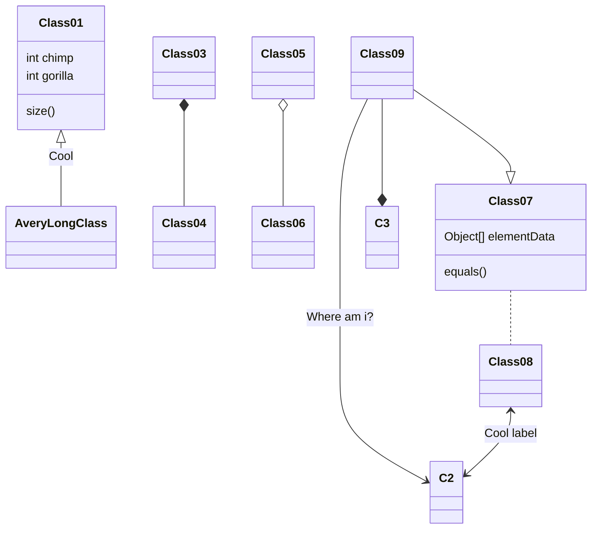

# Computer Vision with OpenCV in C++
Welcome to the Computer Vision with OpenCV in C++ repository! This project is designed to provide a comprehensive introduction to computer vision techniques using the powerful OpenCV library in C++.

## Getting Started
To get started with this repository, you will need to have a basic understanding of C++ and an environment set up with OpenCV. You can find installation instructions and prerequisites in the Installation Guide below.

Feel free to explore the code, run the examples, and modify them to suit your needs. Contributions are welcome, so if you have improvements or additional projects to share, please consider submitting a pull request!

## Installation Guide

### OpenCV dependencies
```md
# Install minimal prerequisites (Ubuntu 18.04 as reference)
sudo apt update && sudo apt install -y cmake g++ wget unzip
 
# Download and unpack sources
wget -O opencv.zip https://github.com/opencv/opencv/archive/4.10.0.zip
unzip opencv.zip
 
# Create build directory
cd opencv-4.10.0 && mkdir build 
```

To enable `cv::imshow` function to run without errors, you need to install `gtk` package and specify `WITH_GTK=ON` in the build command. Add the `--jobs=$(nproc --all)` to utilize all cpu cores for speeding up building source.
```md
# Install gtk package
sudo apt-get install libgtk2.0-dev libgtk-3-dev

# Configure
cmake  -B build -DCMAKE_BUILD_TYPE=Release -D WITH_GTK=ON
 
# Build
cmake --build --jobs=$(nproc --all)
```

### Build with CMake file
```cmake
cmake_minimum_required(VERSION 2.8)
project( application )

set(OpenCV_DIR /path/to/your/opencv-4.x/build)
find_package( OpenCV REQUIRED )

include_directories( ${OpenCV_INCLUDE_DIRS} )
add_executable( application tutorials/<the_file_you_want>.cpp )
target_link_libraries( application ${OpenCV_LIBS} )
```

All the *.cpp are stored in the tutorials directory. You must replace the executable files to the one that you would like to experiment. Then you build the project and run the executable file.
```
cmake -B build && cmake --build build && ./build/application
```

### Torch dependencies

```md
```

### OnnxRuntime dependencies

```md
```

### TensorRT dependencies
```md
```

### Openvino dependencies
```md
```


